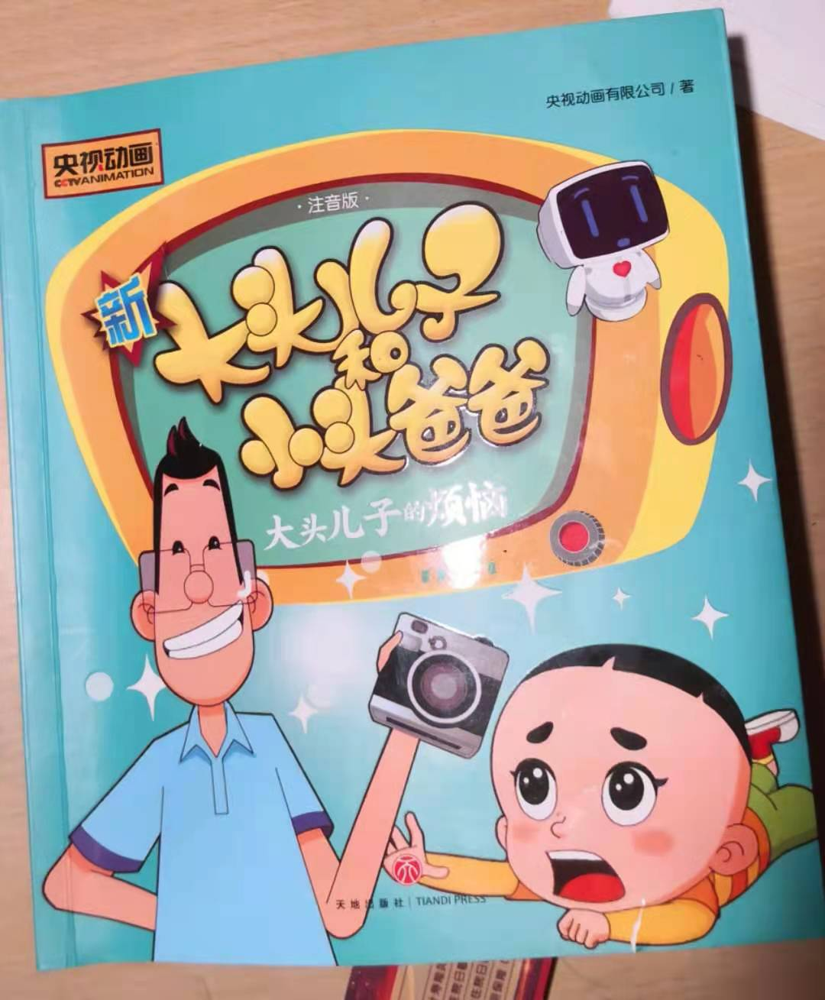

# xixi 2021 reading time record

------------------------------

## 所读书目记录

2021-04-03 至 2021-xx-xx 《[大头儿子和小头爸爸](#大头儿子和小头爸爸封面)》[1]  

------------------------------

## 每天阅读的时长记录

#### April

>Total reading this month: ***200 minutes***

|Month|Time|R Time  ||Time|R Time  | |Time|R Time  | |Time|R Time  |
|-----|----|------|--|----|------|--|----|------  |--|----|------  |
|Apr  | 03 |8  min  || 04 |37 min  || 05 |28 min  || 06 |21 min  |
|     | 07 |18 min  || 08 |27 min  || 09 |        || 10 |20 min  | 
|     | 11 |31 min  || 12 |19 min  || 13 |5  min  || 14 |        | 
|     | 15 |        || 16 |12 min  || 17 |        || 18 |        | 
|     | 19 |        || 20 |        || 21 |        || 22 |        | 
|     | 23 |        || 24 |        || 25 |        || 26 |        | 
|     | 27 |        || 28 |        || 29 |        || 30 |        | 

 

#### May
>Total reading this month: ***0 minutes***

|Month|Time|R Time  ||Time|R Time  ||Time|R Time  ||Time|R Time  |
|-----|----|------|--|----|------|--|----|------  |--|----|------  |
|May  | 01 |        || 02 |        || 03 |        || 04 |        |
|     | 05 |        || 06 |        || 07 |        || 08 |        |
|     | 09 |        || 10 |        || 11 |        || 12 |        | 
|     | 13 |        || 14 |        || 15 |        || 16 |        | 
|     | 17 |        || 18 |        || 19 |        || 20 |        | 
|     | 21 |        || 22 |        || 23 |        || 24 |        | 
|     | 25 |        || 26 |        || 27 |        || 28 |        | 
|     | 29 |        || 30 |        || 31 |        ||    |        | 

 

#### June
>Total reading this month: ***0 minutes***

|Month|Time|R Time  ||Time|R Time  ||Time|R Time  ||Time|R Time  |
|-----|----|------|--|----|------|--|----|------  |--|----|------  |
|Jun  | 01 |        || 02 |        || 03 |        || 04 |        |
|     | 05 |        || 06 |        || 07 |        || 08 |        |
|     | 09 |        || 10 |        || 11 |        || 12 |        | 
|     | 13 |        || 14 |        || 15 |        || 16 |        | 
|     | 17 |        || 18 |        || 19 |        || 20 |        | 
|     | 21 |        || 22 |        || 23 |        || 24 |        | 
|     | 25 |        || 26 |        || 27 |        || 28 |        | 
|     | 29 |        || 30 |        ||    |        ||    |        | 

 

#### July
>Total reading this month: ***0 minutes***

|Month|Time|R Time  ||Time|R Time  ||Time|R Time  ||Time|R Time  |
|-----|----|------|--|----|------|--|----|------  |--|----|------  |
|Jul  | 01 |        || 02 |        || 03 |        || 04 |        |
|     | 05 |        || 06 |        || 07 |        || 08 |        |
|     | 09 |        || 10 |        || 11 |        || 12 |        | 
|     | 13 |        || 14 |        || 15 |        || 16 |        | 
|     | 17 |        || 18 |        || 19 |        || 20 |        | 
|     | 21 |        || 22 |        || 23 |        || 24 |        | 
|     | 25 |        || 26 |        || 27 |        || 28 |        | 
|     | 29 |        || 30 |        || 31 |        ||    |        | 

 

#### August
>Total reading this month: ***0 minutes***

|Month|Time|R Time  ||Time|R Time  ||Time|R Time  ||Time|R Time  |
|-----|----|------|--|----|------|--|----|------  |--|----|------  |
|Aug  | 01 |        || 02 |        || 03 |        || 04 |        |
|     | 05 |        || 06 |        || 07 |        || 08 |        |
|     | 09 |        || 10 |        || 11 |        || 12 |        | 
|     | 13 |        || 14 |        || 15 |        || 16 |        | 
|     | 17 |        || 18 |        || 19 |        || 20 |        | 
|     | 21 |        || 22 |        || 23 |        || 24 |        | 
|     | 25 |        || 26 |        || 27 |        || 28 |        | 
|     | 29 |        || 30 |        || 31 |        ||    |        | 

 

#### September
>Total reading this month: ***0 minutes***

|Month|Time|R Time  ||Time|R Time  ||Time|R Time  ||Time|R Time  |
|-----|----|------|--|----|------|--|----|------  |--|----|------  |
|Sept | 01 |        || 02 |        || 03 |        || 04 |        |
|     | 05 |        || 06 |        || 07 |        || 08 |        |
|     | 09 |        || 10 |        || 11 |        || 12 |        | 
|     | 13 |        || 14 |        || 15 |        || 16 |        | 
|     | 17 |        || 18 |        || 19 |        || 20 |        | 
|     | 21 |        || 22 |        || 23 |        || 24 |        | 
|     | 25 |        || 26 |        || 27 |        || 28 |        | 
|     | 29 |        || 30 |        ||    |        ||    |        | 

 

#### October
>Total reading this month: ***0 minutes***

|Month|Time|R Time  ||Time|R Time  ||Time|R Time  ||Time|R Time  |
|-----|----|------|--|----|------|--|----|------  |--|----|------  |
|Oct  | 01 |        || 02 |        || 03 |        || 04 |        |
|     | 05 |        || 06 |        || 07 |        || 08 |        |
|     | 09 |        || 10 |        || 11 |        || 12 |        | 
|     | 13 |        || 14 |        || 15 |        || 16 |        | 
|     | 17 |        || 18 |        || 19 |        || 20 |        | 
|     | 21 |        || 22 |        || 23 |        || 24 |        | 
|     | 25 |        || 26 |        || 27 |        || 28 |        | 
|     | 29 |        || 30 |        || 31 |        ||    |        | 

 

#### November
>Total reading this month: ***0 minutes***

|Month|Time|R Time  ||Time|R Time  ||Time|R Time  ||Time|R Time  |
|-----|----|------|--|----|------|--|----|------  |--|----|------  |
|Nov  | 01 |        || 02 |        || 03 |        || 04 |        |
|     | 05 |        || 06 |        || 07 |        || 08 |        |
|     | 09 |        || 10 |        || 11 |        || 12 |        | 
|     | 13 |        || 14 |        || 15 |        || 16 |        | 
|     | 17 |        || 18 |        || 19 |        || 20 |        | 
|     | 21 |        || 22 |        || 23 |        || 24 |        | 
|     | 25 |        || 26 |        || 27 |        || 28 |        | 
|     | 29 |        || 30 |        ||    |        ||    |        | 

 

#### December
>Total reading this month: ***0 minutes***

|Month|Time|R Time  ||Time|R Time  ||Time|R Time  ||Time|R Time  |
|-----|----|------|--|----|------|--|----|------  |--|----|------  |
|Dec  | 01 |        || 02 |        || 03 |        || 04 |        |
|     | 05 |        || 06 |        || 07 |        || 08 |        |
|     | 09 |        || 10 |        || 11 |        || 12 |        | 
|     | 13 |        || 14 |        || 15 |        || 16 |        | 
|     | 17 |        || 18 |        || 19 |        || 20 |        | 
|     | 21 |        || 22 |        || 23 |        || 24 |        | 
|     | 25 |        || 26 |        || 27 |        || 28 |        | 
|     | 29 |        || 30 |        || 31 |        ||    |        | 

>[返回顶部](#xixi-2021-reading-time-record)

------------------------------

## 所读书参考照片

[1]: 
###### 大头儿子和小头爸爸封面

